# Calibration_Tutorial
## 1. Introduction
This tutorial of calibration is for the beginners. We propose a multi-sensor system on a car and implement the state-of-art calibration methods. The steps and results are shown below.
<div align="center">
    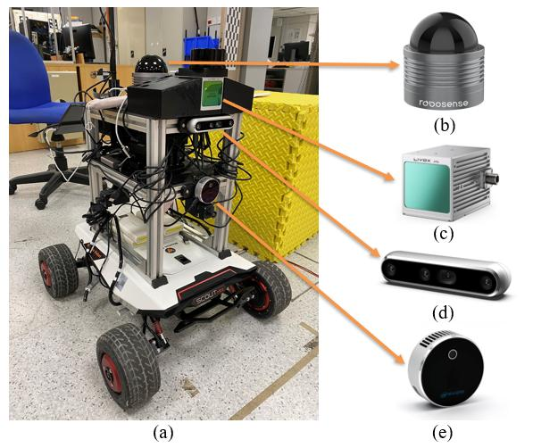
    <font color=#a0a0a0 size=2>(a) Proposed multi-sensor system (b) Robosense bpearl blind spot LiDAR (c) Livox Avia solite-state dense LiDAR (d) Intel Realsense D455 depth camera (e) Intel Realsense L515 depth camera</font>
</div>

## 2. Calibration of binocular cameras
This work is based on [MATLAB_Stereo_camera_calibrator](https://www.mathworks.com/help/vision/ref/stereocameracalibrator-app.html)
1. Prepare the chess board and measure the square size
2. Keep the system stable and record ROS bags containing the binocular camera images

```
rosbag record -O xxx.bag /camera_topic1 /camera_topic2
```

3. Extract images from the bag (run the command below and play the rosbag)
```
rosrun image_view extract_images _sec_per_frame:=0.5 image:=/camera_topic
```
4. After repeating the steps above, we get >20 pairs of images. 

Our sample data is in /data/binocular
<div align="center">
    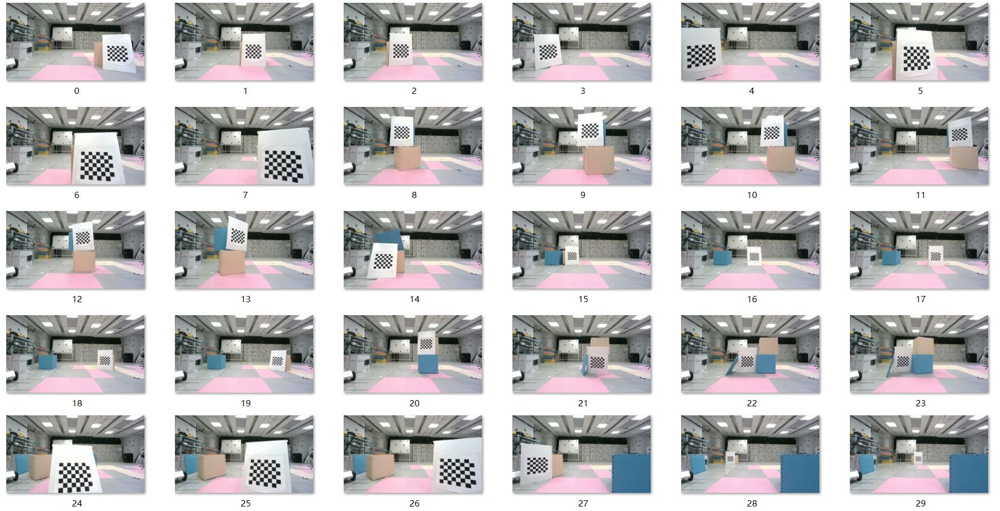
    <font color=#a0a0a0 size=2>Image from D455 camera</font>
</div>

<div align="center">
    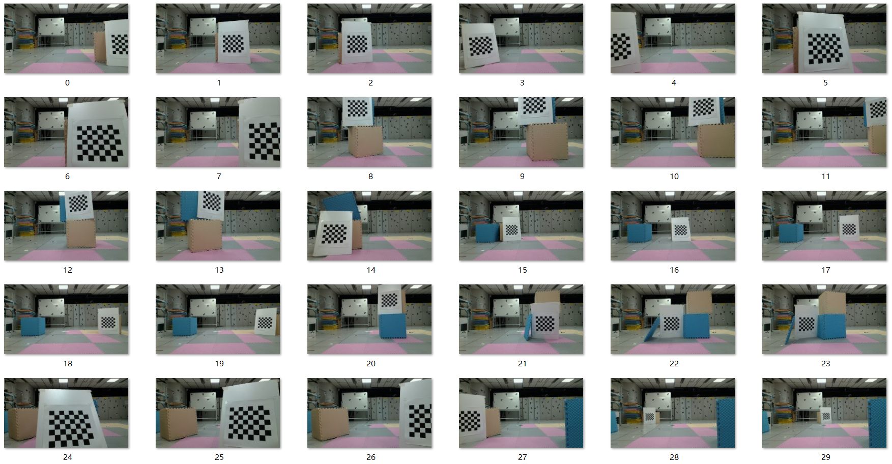
    <font color=#a0a0a0 size=2>Image from L515 camera</font>
</div>

5. Use the MATLAB toolbox to calibrate the two cameras and get the result

## 3. Targetless calibration of Livox LiDAR and D455 camera
1. Set up the environment and follow the steps [Targetless lidar_camera_calib](https://github.com/hku-mars/livox_camera_calib)

2. Our sample data set is in the file /data/livox_camera_targetless
<div align="center">
    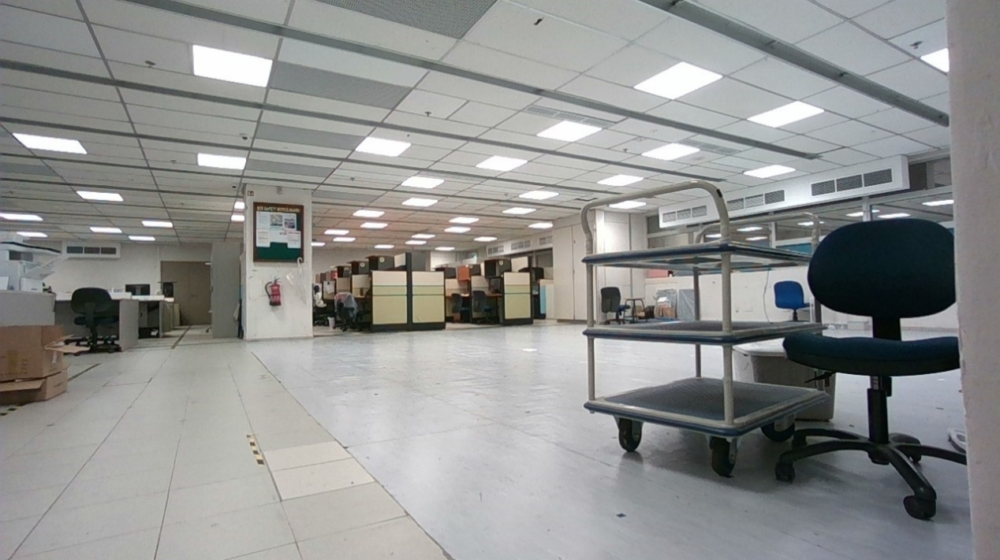
    <font color=#a0a0a0 size=2>Calibration scene</font>
</div>

3. Edit the file path in the yaml file, then run the programe and wait the result
<div align="center">
    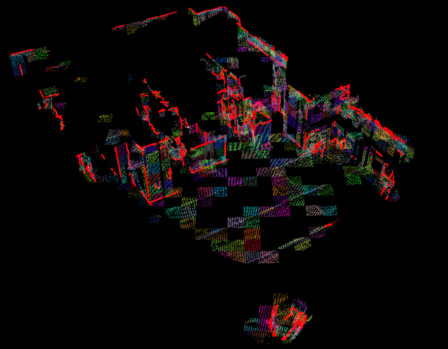
    <font color=#a0a0a0 size=2>LiDAR point cloud edges</font>
</div>
<div align="center">
    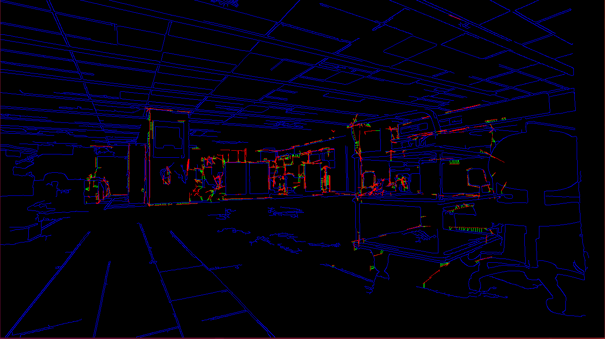
    <font color=#a0a0a0 size=2>Image edges (blue) and LiDAR point cloud edges (red), green lines represent their corresponding relations</font>
</div>

4. Calibration result 
<div align="center">
    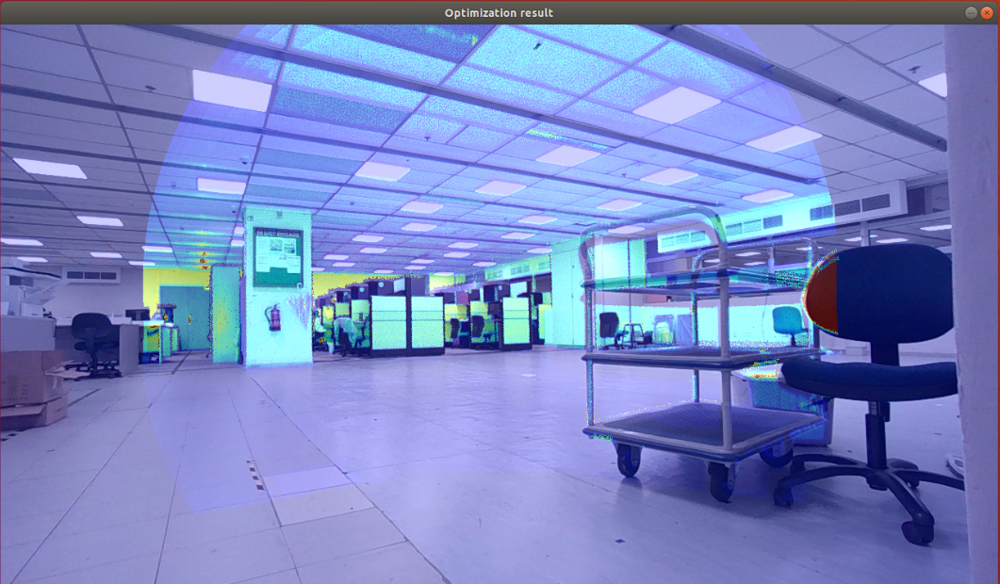
    <font color=#a0a0a0 size=2>Projection of point cloud onto the image using calibrated extrinsic matrix</font>
</div>
 
5. Multi-scene calibration
The targetless method needs scene with rich edge features. If not, the calibration result will be false because of false matched edges.
<div align="center">
    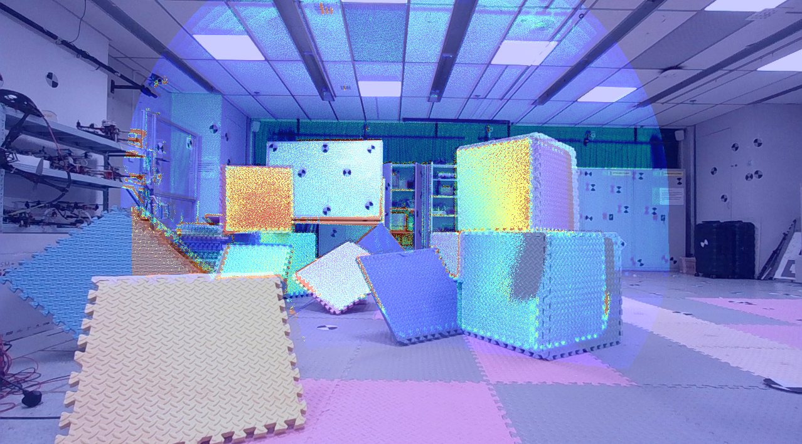
    <font color=#a0a0a0 size=2>False matched edge leading to bad calibration result</font>
</div>
When use multi-scene to do the calibration, the problem can be allievated.
<div align="center">
    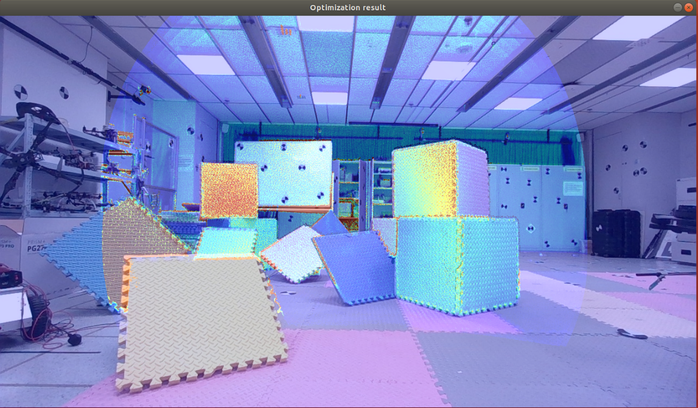
    <font color=#a0a0a0 size=2>Multi-scene calibration result</font>
</div>
 

## 4. Target-based calibration of RsLiDAR and D455 camera
This work is based on [Target-based lidar_camera_calibrator](https://github.com/HITSZ-NRSL/lidar_camera_calibrator)
1. Prepare calibration board
<div align="center">
    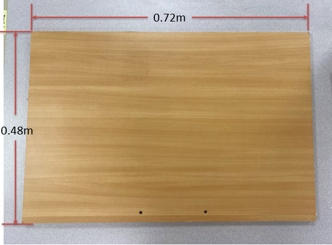
    <font color=#a0a0a0 size=2>Calibration board target</font>
</div>

2. Our sample data set in in file /data/rslidar_camera

3. Select corner points of the target manually
<div align="center">
    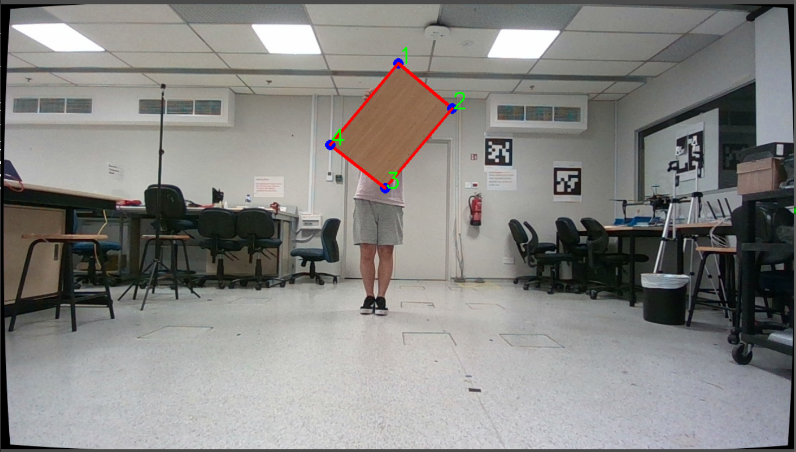
    <font color=#a0a0a0 size=2>Corner points of the target in the image</font>
</div>

4. Select the ROI from the LiDAR point cloud 
<div align="center">
    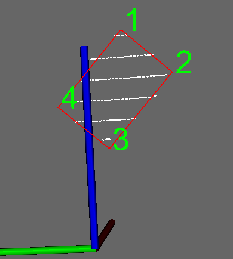
    <font color=#a0a0a0 size=2>Corner points of the target in the point cloud</font>
</div>

5. Solve the PnP problem and get the result
<div align="center">
    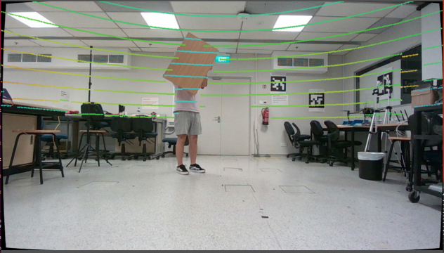
    <font color=#a0a0a0 size=2>Projection of point cloud onto the image using calibrated extrinsic matrix</font>
</div>


## 5. Target-based calibration of Livox LiDAR and D455 camera

1. Our sample data set in in file /data/livox_camera

2. The steps are the same as above. We stable the system and record rosbag 1~2 seconds. Then obtain the accumulated pcd file from the bag. Finally, we use the toolbox and calibrate the dense LiDAR.
<div align="center">
    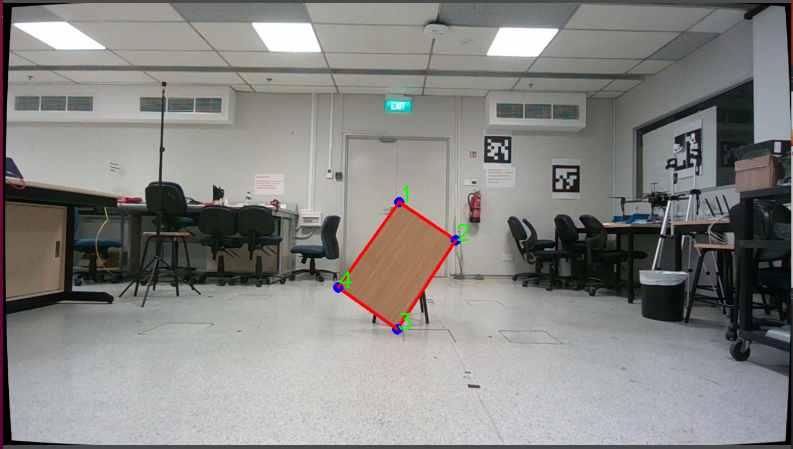
    <font color=#a0a0a0 size=2>Target pose</font>
</div>
<div align="center">
    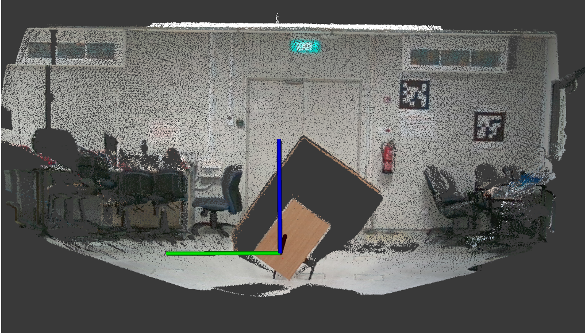
    <font color=#a0a0a0 size=2>Colored point cloud</font>
</div>


## 6. Target-based calibration using MATLAB toolbox
This method is based on [MATLAB_Lidar_camera_calibrator](https://www.mathworks.com/help/lidar/ug/lidar-and-camera-calibration.html)
1. Prepare a chessboard and measure the size of it

2. Our sample data set in in file /data/rslidar_camera_matlab

3. Get synchronized data using the launch file

4. Input data in MATLAB. The image corner and LiDAR point cloud target plane can be detected.
<div align="center">
    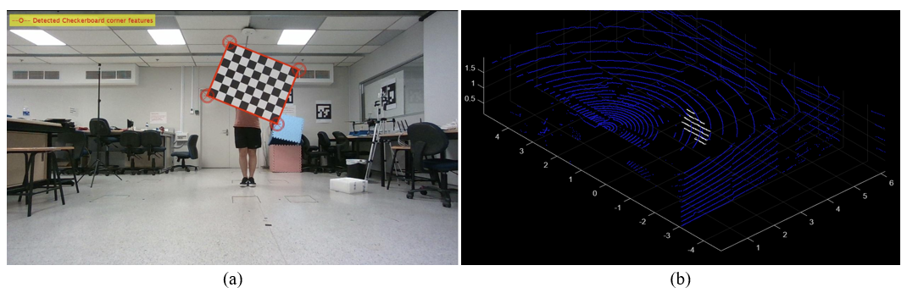
    <font color=#a0a0a0 size=2>Detected features</font>
</div>

5. Calibrate and reject the image-point cloud pairs with large error
<div align="center">
    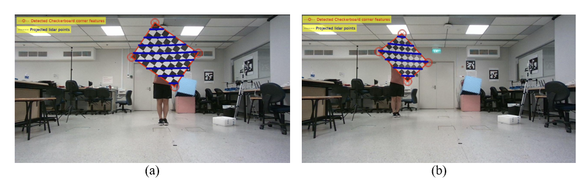
    <font color=#a0a0a0 size=2>Projection of point cloud onto the image using calibrated extrinsic matrix</font>
</div>

## 7. Publish transformation in ROS
The obtained transformations can be publish in ROS using [static_transform_publisher](http://wiki.ros.org/tf#static_transform_publisher). Finally, the sensor fusion is realized.
```
static_transform_publisher x y z qx qy qz qw frame_id child_frame_id  period_in_ms
```


