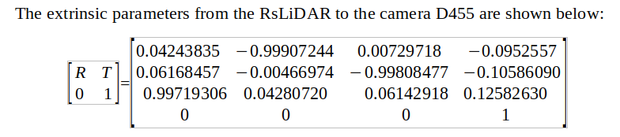

# Calibration_Tutorial
## 1. Introduction
This tutorial on calibration is for beginners. We propose a multi-sensor system on a car and implement state-of-art calibration methods. The steps and results are described in detail.
<div align="center">
    
    <font color=#a0a0a0 size=2><br>(a) Proposed multi-sensor system (b) Robosense bpearl blind spot LiDAR (c) Livox Avia solite-state dense LiDAR (d) Intel Realsense D455 depth camera (e) Intel Realsense L515 depth camera</font>
</div>

## 2. Prerequisites
In our repositories, we provide a target-based toolbox based on [lidar_camera_calibrator](https://github.com/HITSZ-NRSL/lidar_camera_calibrator) . We also provide our sample dataset and calibration result in the file /data.

### Dependencies

- ROS

- Qt 5 (system)

- Eigen 3 (3.3+)

- [ceres](https://github.com/ceres-solver/ceres-solver.git)

  > ```bash
  > # ceres dependencies
  > $ sudo apt-get install  liblapack-dev libsuitesparse-dev libcxsparse3 libgflags-dev libgoogle-glog-dev libgtest-dev
  > ```
- [g2o](https://github.com/RainerKuemmerle/g2o.git)

  > ```bash
  > # g2o dependencies
  > $ sudo apt-get install qt5-qmake qt5-default libqglviewer-dev-qt5 libsuitesparse-dev libcxsparse3 libcholmod3
  > ```
- [sophus](https://github.com/strasdat/Sophus.git)

### Build

```bash
$ mkdir -p ws_calibrator/src && cd ws_calibrator
$ git clone git clone REPOSITORY_GIT_LINK src/lidar_camera_calibrator
$ catkin_make
```
### Test
After modifying the config file and changing the path in /launch
```bash
source ~/ws_calibrator/devel/setup.bash
roslaunch lidar_camera_calibrator calibrate.launch 
```


## 3. Calibration of binocular cameras
This work is based on MATLAB [Stereo_camera_calibrator](https://www.mathworks.com/help/vision/ref/stereocameracalibrator-app.html)<br>
3.1 Prepare the chess board and measure the square size. Our sample chessboard is 4.8cmx4.8cm.<br>

3.2 Keep the system stable and record >20 ROS bags containing the images from the camera D455 and camera L515 

```
rosbag record -O xxx.bag /camera_topic1 /camera_topic2
```

3.3 Extract images from the bags (run the command below and play the rosbag)
```
rosrun image_view extract_images _sec_per_frame:=1 image:=/camera_topic
```
3.4 After repeating the steps above, we get >20 pairs of matched images. Our sample data is in /data/binocular

<div align="center">
    
    <font color=#a0a0a0 size=2><br>Image from D455 camera</font>
</div>

<div align="center">
    
    <font color=#a0a0a0 size=2><br>Image from L515 camera</font>
</div>

3.5 Use the [MATLAB toolbox](https://www.mathworks.com/help/vision/ref/stereocameracalibrator-app.html) to calibrate the two cameras<br>

3.6 Remove the image pairs with large errors, then the result is optimized.


## 4. Targetless calibration of Livox LiDAR and D455 camera
This work is based on Targetless [lidar_camera_calib](https://github.com/hku-mars/livox_camera_calib)<br>

4.1 Set up the environment and follow the steps shown in https://github.com/hku-mars/livox_camera_calib

4.2 Record ROS bag containing Lidar and camera messages for more than 20s to accumulate dense point cloud. Then, change the bag file into a pcd file. The tool bag_to_pcd can be found in [lidar_camera_calib](https://github.com/hku-mars/livox_camera_calib). After modifying the path config file, we use
```
roslaunch livox_camera_calib bag_to_pcd.launch
```
Then, we can get the accumulated point cloud. Our sample data set is in  /data/livox_camera_targetless. Because of the limited uploaded file size, we down sample the point cloud.

4.3 Edit the file path in the yaml file, then run the program and wait for the result
<div align="center">
    
    <font color=#a0a0a0 size=2><br>Targetless calibration scene</font>
</div>
<div align="center">
    
    <font color=#a0a0a0 size=2><br>LiDAR point cloud edges</font>
</div>
<div align="center">
    
    <font color=#a0a0a0 size=2><br>Image edges (blue) and LiDAR point cloud edges (red), green lines represent their corresponding relations</font>
</div>

4.4 Calibration result 
<div align="center">
    
    <font color=#a0a0a0 size=2><br>Projection of point cloud onto the image using calibrated extrinsic matrix</font>
</div>
 
4.5 Multi-scene calibration<br>
The targetless method needs a scene with rich edge features. If not, the calibration result will be bad because of falsely matched edges.
<div align="center">
    
    <font color=#a0a0a0 size=2><br>Falsely matched edge leading to bad calibration result</font>
</div>
When using multi-scenes to do the calibration, the problem can be alleviated.
<div align="center">
    
    <font color=#a0a0a0 size=2><br>After multi-scene calibration result</font>
</div>
 

## 5. Target-based calibration of RsLiDAR and D455 camera
This work is based on Target-based [lidar_camera_calibrator](https://github.com/HITSZ-NRSL/lidar_camera_calibrator)

5.1 Prepare calibration board
<div align="center">
    
    <font color=#a0a0a0 size=2><br>Calibration board target</font>
</div>

5.2 We uphold the target and record the ROS bag. Then, extract pcd files and images from the bag. We use get_sync_data.launch in our repository to ensure the pcd and image obtained are synchronized. Our sample data set is in file /data/rslidar_camera

5.3 Select corner points of the target manually by clicking on the image viewer
<div align="center">
    
    <font color=#a0a0a0 size=2><br>Corner points of the target in the image</font>
</div>

5.4 Select the ROI from the LiDAR point cloud by adjusting the parameters in the UI
<div align="center">
    
    <font color=#a0a0a0 size=2><br>UI to find ROI</font>
</div>

<div align="center">
    
    <font color=#a0a0a0 size=2><br>Corner points of the target in the point cloud</font>
</div>

5.5 Solve the PnP problem and get the result by the toolbox
<div align="center">
    
    <font color=#a0a0a0 size=2><br>Projection of point cloud onto the image using calibrated extrinsic matrix</font>
</div>


## 6. Target-based calibration of Livox LiDAR and D455 camera
6.1 Our sample data set is in file /data/livox_camera

6.2 The steps are the same as above. We stable the system and record rosbag for 1~2 seconds. Then, obtain the accumulated pcd file from the bag. Finally, we use the toolbox and calibrate the dense LiDAR.
<div align="center">
    
    <font color=#a0a0a0 size=2><br>Target pose</font>
</div>
<div align="center">
    
    <font color=#a0a0a0 size=2><br>Colored point cloud</font>
</div>


## 7. Target-based calibration using MATLAB toolbox
This method is based on MATLAB [Lidar_camera_calibrator](https://www.mathworks.com/help/lidar/ug/lidar-and-camera-calibration.html)<br>

7.1 Prepare a chessboard and measure its size. The size of the chessboard square in this experiment is 10.7cmx10.7cm with 0.6cm boarder to pad.

7.2 To get the input pcd and image files. Same step is shown in 5.2. Our sample data set is in file /data/rslidar_camera_matlab

7.3 Input data in MATLAB. The image corner and the target plane of the LiDAR point cloud can be detected.
<div align="center">
    
    <font color=#a0a0a0 size=2><br>Detected features</font>
</div>

7.4 Calibrate and reject the image-point cloud pairs with large error
<div align="center">
    
    <font color=#a0a0a0 size=2><br>Projection of point cloud onto the image using calibrated extrinsic matrix</font>
</div>

## 8. Publish transformation in ROS
The obtained transformations can be published in ROS using [static_transform_publisher](http://wiki.ros.org/tf#static_transform_publisher). Finally, the sensor fusion is realized.
```
static_transform_publisher x y z qx qy qz qw frame_id child_frame_id  period_in_ms
```

## 9. Calibration results for reference
9.1 Livox Lidar to camera D455 (targetless method)
<div align="center">
    
    <font color=#a0a0a0 size=2><br></font>
</div>
9.2 RsLidar to camera D455 (target-based method 1)
<div align="center">
    
    <font color=#a0a0a0 size=2><br></font>
</div>

9.3 Livox Lidar to camera D455 (target-based method 1)
<div align="center">
    
    <font color=#a0a0a0 size=2><br></font>
</div>

9.4 RsLidar to camera D455 (target-based method 2)
<div align="center">
    
    <font color=#a0a0a0 size=2><br></font>
</div>


## 10. References
[1] Z. Zhang, "A flexible new technique for camera calibration," in IEEE Transactions on Pattern Analysis and Machine Intelligence, vol. 22, no. 11, pp. 1330-1334, Nov. 2000, doi: 10.1109/34.888718.
<br>
[2] J. -K. Huang and J. W. Grizzle, "Improvements to Target-Based 3D LiDAR to Camera Calibration," in IEEE Access, vol. 8, pp. 134101-134110, 2020, doi: 10.1109/ACCESS.2020.3010734.
<br>
[3] C. Yuan, X. Liu, X. Hong and F. Zhang, "Pixel-Level Extrinsic Self Calibration of High Resolution LiDAR and Camera in Targetless Environments," in IEEE Robotics and Automation Letters, vol. 6, no. 4, pp. 7517-7524, Oct. 2021, doi: 10.1109/LRA.2021.3098923.

## 11. Acknowledgement
1. Binocular camera calibration: Matlab [Stereo_camera_calibrator](https://www.mathworks.com/help/vision/ref/stereocameracalibrator-app.html)
2. Targetless calibration of Livox LiDAR and D455 camera: [lidar_camera_calib](https://github.com/hku-mars/livox_camera_calib)
3. Target-based method 1:  [lidar_camera_calibrator](https://github.com/HITSZ-NRSL/lidar_camera_calibrator)
4. Target-based method 2: MATLAB [Lidar_camera_calibrator](https://www.mathworks.com/help/lidar/ug/lidar-and-camera-calibration.html)


